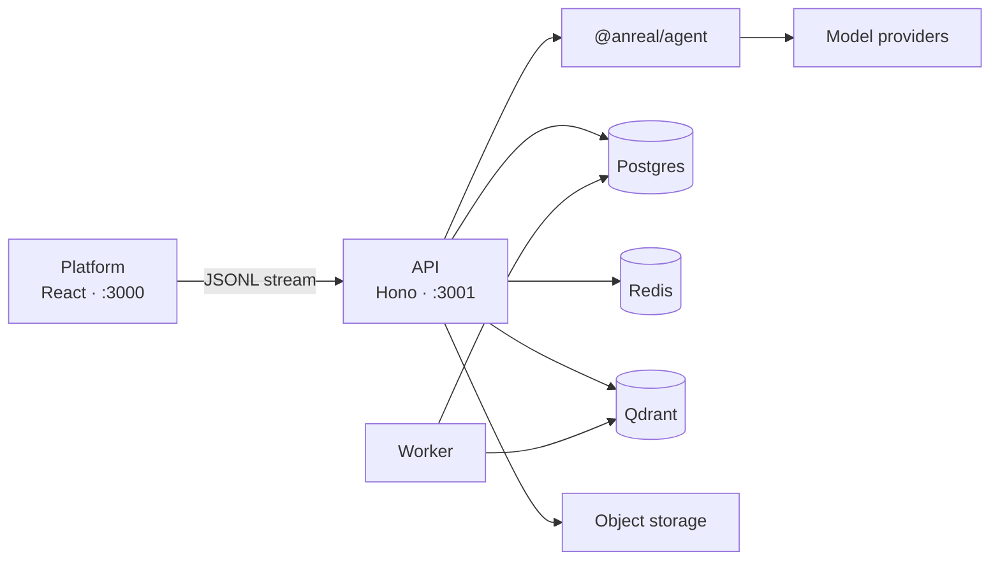

# anreal

A private AI workspace for documents, data, and the web. Ask in plain language. The agent answers in the thread, with the search, the chart, the citations, and the file it produced.

[](https://nodejs.org)
[](https://pnpm.io)
[](https://www.typescriptlang.org)

anreal is a full-stack workspace built on [Anvia](https://anvia.dev). The React app streams an agent run from a Hono API. Sessions and memory stay in Postgres, document chunks stay in Qdrant, and ingestion, summaries, and site builds run on a background worker. Model access is whatever provider you configure in `.env`.

<p align="center">
  
</p>

## What you can do

| | |
| --- | --- |
|  **Cited research.** A long brief stays grounded. Citations in the answer open the pages and figures the agent actually used. |  **Data in the thread.** Attach a spreadsheet. The agent reads it, runs the analysis, and draws the chart next to the explanation. |
|  **Web, with the trail visible.** Search queries, reasons, sources, and images stay on screen, so an answer from the public web can be checked. |  **A site, not a mock.** Describe a page. The agent builds a real static site, previews it, versions it, and packs a zip. |

Around those four flows, the workspace also keeps projects, documents, images, tasks, and artifacts; renders Markdown and LaTeX; generates and edits images; and asks before it searches the web or spends an image call.

## How it fits together



| Package | Role |
| --- | --- |
| `@anreal/platform` | The workspace. TanStack Router, Tailwind CSS 4, the Anvia React client. |
| `@anreal/api` | Chat, auth, documents, images, sites, providers. Hono, Prisma 7, BullMQ, OpenAPI. |
| `@anreal/agent` | The agent factory: instructions, tools, providers, tracing, and evals. |

| | |
| --- | --- |
| UI | React 19, Vite 8, TanStack Router, Tailwind CSS 4, ECharts, KaTeX |
| API | Hono, Better Auth, Prisma 7, Postgres 16, Redis 7, BullMQ |
| Agent | Anvia, Zod, Qdrant, Tavily, optional Langfuse |
| Sites and files | Sandboxed Vite builds, Playwright captures, S3-compatible storage for images |
| Repo | pnpm 10 workspaces |

A run is a `POST /api/chat` with a session id. The API builds an agent, restores that session’s memory, and streams events back. Tool calls that need a person (web search, image generation) pause on an approval card. Ambiguous requests pause on a short clarification wizard. The OpenAPI document at `/doc` is the contract for any other client.

## Getting started

### Prerequisites

- Node.js 22.18 or newer
- pnpm 10.30.3 (`packageManager` in the root `package.json`)
- Docker, for Postgres, Redis, and Qdrant

### Install

```bash
pnpm install
cp .env.example .env
```

Fill `.env` from the root. The names below are the ones that decide whether the app actually runs. Everything else has a default in `.env.example`.

| Variable | Required for |
| --- | --- |
| `OPENAI_API_KEY`, `OPENAI_BASE_URL` | Chat and image generation. The sample base URL is OpenRouter. |
| `MISTRAL_API_KEY` | OCR and embeddings while documents are ingested. |
| `BETTER_AUTH_SECRET` | Session cookies. `openssl rand -base64 32` |
| `DATABASE_URL`, `REDIS_URL`, `QDRANT_URL` | Left as-is, these match `docker-compose.yml`. |
| `TAVILY_API_KEY` | Web search. The control stays off when this is empty. |
| `R2_ACCOUNT_ID`, `R2_ACCESS_KEY_ID`, `R2_SECRET_ACCESS_KEY`, `R2_BUCKET_NAME`, `R2_ENDPOINT` | Storing generated images. |
| `CONTEXT7_API_KEY` | Library and API docs through Context7. Optional. |
| `LANGFUSE_BASE_URL`, `LANGFUSE_PUBLIC_KEY`, `LANGFUSE_SECRET_KEY` | Traces. Optional. Leave them empty to skip. |
| `PROVIDER_CREDENTIALS_KEY` | Encrypting a user’s own provider keys. `openssl rand -hex 32`. Required in production. |
| `MCP_CREDENTIALS_KEY` | Encrypting stored MCP tokens. Separate from the provider key. Required in production. |

`PLATFORM_ORIGIN` defaults to `http://localhost:3000` and `BETTER_AUTH_URL` to `http://localhost:3001`. Add any extra browser origin to `TRUSTED_ORIGINS`.

### Data stores

```bash
docker compose up -d
pnpm --filter @anreal/api db:migrate
pnpm --filter @anreal/api db:seed
```

Compose publishes Postgres on `15433`, Redis on `16379`, and Qdrant on `16333`. `db:seed` loads the model catalog and is safe to run again.

### Run

```bash
pnpm dev
```

That starts the API, the worker, and the web app together.

| | |
| --- | --- |
| Workspace | http://localhost:3000 |
| API | http://localhost:3001 |
| Scalar reference | http://localhost:3001/scalar |
| OpenAPI 3.1 | http://localhost:3001/doc |
| Health | http://localhost:3001/health |

The dev servers listen on every interface. Vite prints a Network URL, and a phone on the same Wi-Fi can open it. Set `HOST=127.0.0.1` in `.env` to keep the API on localhost.

Sign up at `/register`, then start a chat. The first useful thing to try is a CSV in the composer, or a question that needs the web.

## Scripts

Run these from the repo root.

```bash
pnpm dev                  # API, worker, and platform
pnpm dev:api              # API only
pnpm dev:worker           # worker only
pnpm dev:platform         # web app only

pnpm --filter @anreal/api db:generate
pnpm --filter @anreal/api db:migrate     # development
pnpm --filter @anreal/api db:deploy      # production
pnpm --filter @anreal/api db:seed
pnpm --filter @anreal/api db:studio

pnpm --filter @anreal/api test
pnpm --filter @anreal/platform test
pnpm --filter @anreal/agent test
pnpm --filter @anreal/agent evals        # live-model behavior evals

pnpm --filter @anreal/api smoke:auth     # register, sign in, chat; API must be up
pnpm --filter @anreal/platform e2e
```

The Playwright suite under `apps/platform/e2e/` boots its own stub model and dev stack. Postgres and Redis need to be up, the database migrated, and ports `3000`, `3001`, and `18765` free. Run it from a shell that does not already export a real `OPENAI_BASE_URL`. A second config, `playwright.real-llm.config.ts`, talks to the provider in `.env` against an already running `pnpm dev`.

## Repository

```
apps/
  api/            Hono API, Prisma schema, workers, OpenAPI
  platform/       React workspace
packages/
  agent/          Agent factory, tools, prompts, providers, evals
docs/images/      Stills used in this README
docker-compose.yml
.env.example
```

Prisma Client is generated into `apps/api/src/generated`, which is gitignored. `pnpm install` generates it. After a schema change, run `db:generate` again.

## Authentication

Email and password go through Better Auth at `/api/auth/*`. The web app keeps an HTTP-only session cookie. A native client can read `set-auth-token` from the sign-in response and send `Authorization: Bearer <token>` after that. Both paths resolve to the same session. Chat memory is scoped by session and user. Documents belong to the user who uploaded them, with a 200 MB quota per account.

Interactive requests are easiest in Scalar. For a raw call:

```bash
curl -D - -X POST http://localhost:3001/api/auth/sign-in/email \
  -H "content-type: application/json" \
  -H "origin: http://localhost:3000" \
  -d '{"email":"ada@example.com","password":"correct-horse-battery"}'

curl http://localhost:3001/api/chat/sessions \
  -H "authorization: Bearer <set-auth-token>"
```

## License

[ISC](https://www.isc.org/licenses/), as declared in `package.json`.
