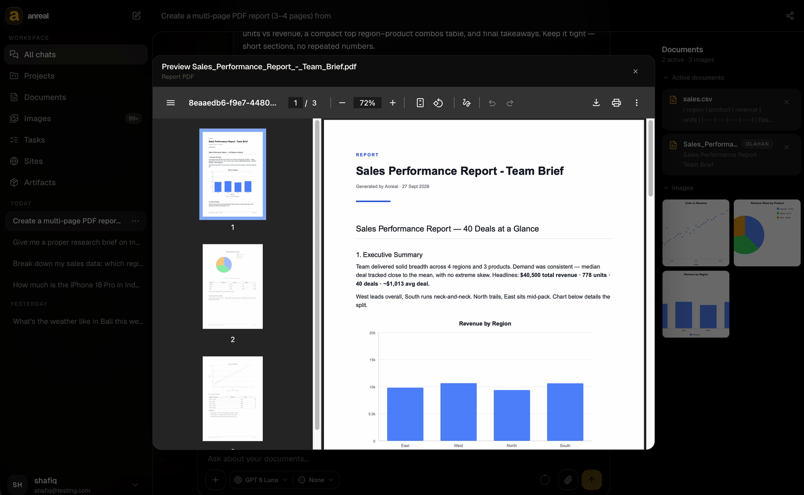
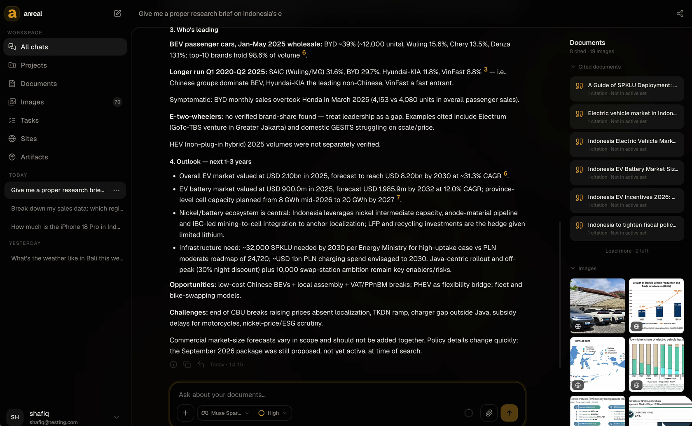
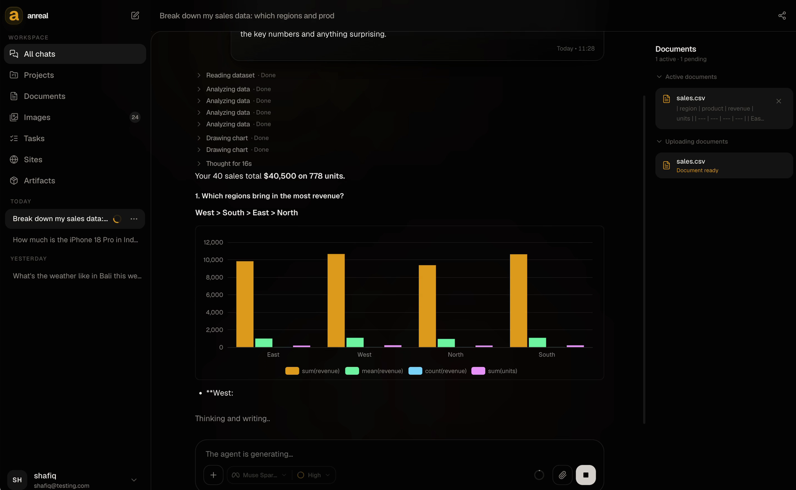
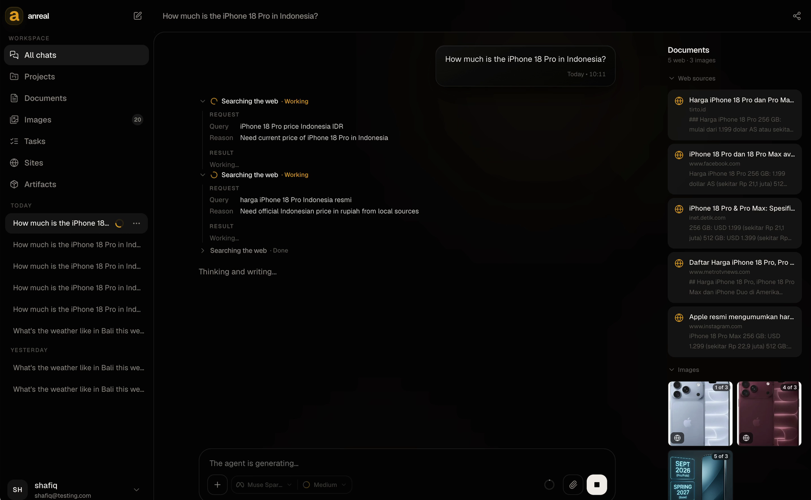
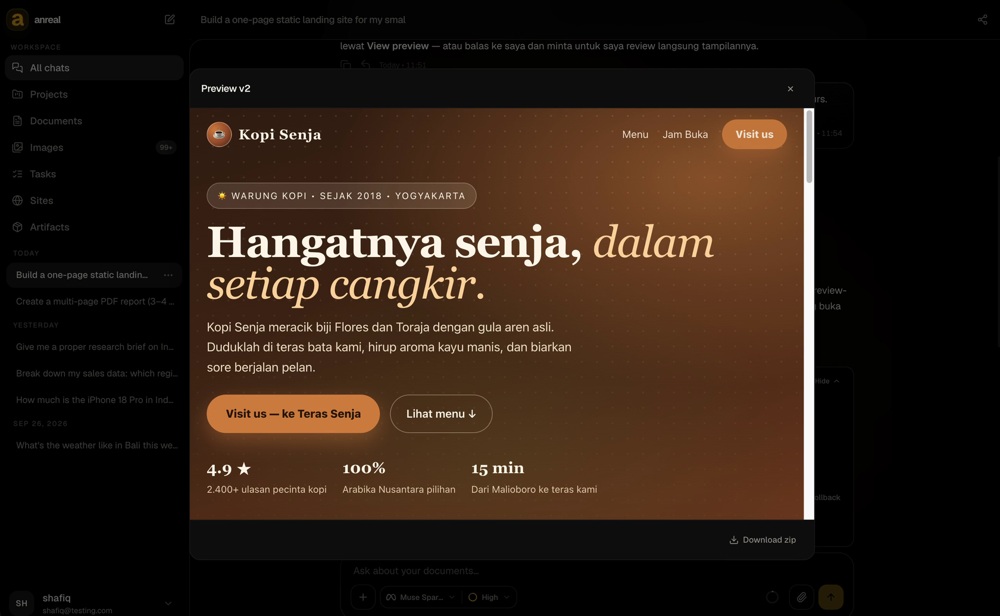
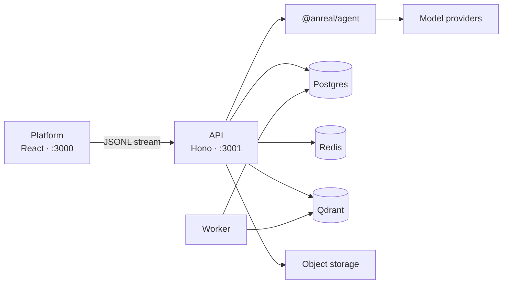

<p align="center">
  
</p>

<h1 align="center">anreal</h1>

<p align="center">
  A private workspace for questions that start in a document and end as something you can keep: a chart, a cited brief, a PDF, or a site.
</p>

<p align="center">
  <a href="LICENSE"></a>
  <a href="https://nodejs.org"></a>
  <a href="https://pnpm.io"></a>
</p>

anreal is a full-stack workspace built on [Anvia](https://anvia.dev). You attach a file or ask in plain language. The agent streams the work into the same thread: the search, the numbers, the sources, and the file it just made. Sessions live in Postgres, document chunks live in Qdrant, and the model is whichever provider you configure.

<p align="center">
  
</p>

## The workspace

| | |
| --- | --- |
|  **Research, with the footnotes attached.** A long brief keeps its citations. Each one opens the page or figure behind the claim. |  **A spreadsheet, read in place.** Drop in a CSV. The agent totals the rows and draws the chart beside the explanation. |
|  **A search you can follow.** Queries, reasons, sources, and images stay on screen while the answer is written. |  **A page you can publish.** Describe a site. anreal builds it, previews the result, keeps the version, and packs a zip. |

The same place holds projects, documents, images, tasks, and artifacts. Replies render Markdown and LaTeX. A search of the public web, and a call that generates an image, both wait for your approval.

## Quick start

You need Node.js 22.18 or newer, pnpm 10.30.3, and Docker.

```bash
pnpm install
cp .env.example .env
docker compose up -d
pnpm --filter @anreal/api db:migrate
pnpm --filter @anreal/api db:seed
pnpm dev
```

Open http://localhost:3000 and create an account. A CSV in the composer, or a question that needs the web, is enough to see the product.

Docker Compose publishes Postgres on `15433`, Redis on `16379`, and Qdrant on `16333`. The seed loads the model catalog and is safe to run again. `pnpm dev` starts the API, the background worker, and the web app together.

| | |
| --- | --- |
| Workspace | http://localhost:3000 |
| API | http://localhost:3001 |
| API reference | http://localhost:3001/scalar |
| OpenAPI 3.1 | http://localhost:3001/doc |
| Health | http://localhost:3001/health |

### Configuration

Copy `.env.example` and fill the keys for the parts you want running. The database URLs already match Compose.

| Variable | What it unlocks |
| --- | --- |
| `OPENAI_API_KEY`, `OPENAI_BASE_URL` | Chat and image generation. The sample base URL is OpenRouter. |
| `MISTRAL_API_KEY` | OCR and embeddings while a document is ingested. |
| `BETTER_AUTH_SECRET` | Signed session cookies. Generate one with `openssl rand -base64 32`. |
| `TAVILY_API_KEY` | Web search. |
| `R2_ACCOUNT_ID`, `R2_ACCESS_KEY_ID`, `R2_SECRET_ACCESS_KEY`, `R2_BUCKET_NAME`, `R2_ENDPOINT` | Storage for generated images. |
| `CONTEXT7_API_KEY` | Library and API docs through Context7. |
| `LANGFUSE_BASE_URL`, `LANGFUSE_PUBLIC_KEY`, `LANGFUSE_SECRET_KEY` | Traces for each agent run. |
| `PROVIDER_CREDENTIALS_KEY` | Encryption for a user’s own provider keys. `openssl rand -hex 32`. Required in production. |
| `MCP_CREDENTIALS_KEY` | Encryption for stored MCP tokens, separate from provider keys. Required in production. |

`PLATFORM_ORIGIN` is `http://localhost:3000`. `BETTER_AUTH_URL` is `http://localhost:3001`. Extra browser origins go in `TRUSTED_ORIGINS`.

The dev servers listen on every interface, and Vite prints a Network URL a phone on the same Wi-Fi can open. Set `HOST=127.0.0.1` to keep the API on the machine.

## Architecture



| Package | Responsibility |
| --- | --- |
| `@anreal/platform` | The workspace. TanStack Router, Tailwind CSS 4, and the Anvia React client. |
| `@anreal/api` | Chat, auth, documents, images, sites, and providers. Hono, Prisma 7, BullMQ, and OpenAPI. |
| `@anreal/agent` | The agent itself: instructions, tools, providers, tracing, and evals. |

| Layer | Stack |
| --- | --- |
| Interface | React 19, Vite 8, TanStack Router, Tailwind CSS 4, ECharts, KaTeX |
| Service | Hono, Better Auth, Prisma 7, Postgres 16, Redis 7, BullMQ |
| Agent | Anvia, Zod, Qdrant, Tavily, Langfuse when configured |
| Output | Sandboxed Vite builds, Playwright captures, S3-compatible image storage |
| Repository | pnpm 10 workspaces |

A turn is `POST /api/chat` with a session id. The API builds an agent, restores that session’s memory, and streams events back. A tool that spends money or reaches the public web pauses on an approval card. An ambiguous request pauses on a short clarification. `/doc` is the contract for any other client.

## Development

From the repository root:

```bash
pnpm dev                  # API, worker, and platform
pnpm dev:api
pnpm dev:worker
pnpm dev:platform

pnpm --filter @anreal/api db:generate
pnpm --filter @anreal/api db:migrate     # local development
pnpm --filter @anreal/api db:deploy      # production
pnpm --filter @anreal/api db:seed
pnpm --filter @anreal/api db:studio

pnpm --filter @anreal/api test
pnpm --filter @anreal/platform test
pnpm --filter @anreal/agent test
pnpm --filter @anreal/agent evals        # behavior evals against a live model

pnpm --filter @anreal/api smoke:auth     # register, sign in, chat; the API must already be up
pnpm --filter @anreal/platform e2e
```

Playwright, under `apps/platform/e2e/`, boots a stub model and its own dev stack. Postgres and Redis need to be up, the database migrated, and ports `3000`, `3001`, and `18765` free. Start it from a shell that has no real `OPENAI_BASE_URL` exported. `playwright.real-llm.config.ts` uses the provider in `.env` against an already running `pnpm dev`.

```
apps/
  api/            Hono API, Prisma schema, workers, OpenAPI
  platform/       React workspace
packages/
  agent/          Agent factory, tools, prompts, providers, evals
docs/images/      Stills in this README
docker-compose.yml
.env.example
```

Prisma Client is generated into `apps/api/src/generated`, which is gitignored. `pnpm install` generates it. After a schema change, run `db:generate` again.

## Authentication

Email and password go through Better Auth at `/api/auth/*`. The web app keeps an HTTP-only session cookie. A native client reads `set-auth-token` from the sign-in response and sends `Authorization: Bearer <token>` after that. Both paths resolve to the same session. Memory is scoped to the session and the user. Documents belong to the account that uploaded them, with a 200 MB quota.

```bash
curl -D - -X POST http://localhost:3001/api/auth/sign-in/email \
  -H "content-type: application/json" \
  -H "origin: http://localhost:3000" \
  -d '{"email":"ada@example.com","password":"correct-horse-battery"}'

curl http://localhost:3001/api/chat/sessions \
  -H "authorization: Bearer <set-auth-token>"
```

Scalar at `/scalar` is the easier way to click through the same API.

## Contributing

Issues and pull requests are welcome. Open a branch from `main`, keep the change focused, and say what you ran.

## License

anreal is open source under the [MIT License](LICENSE).
